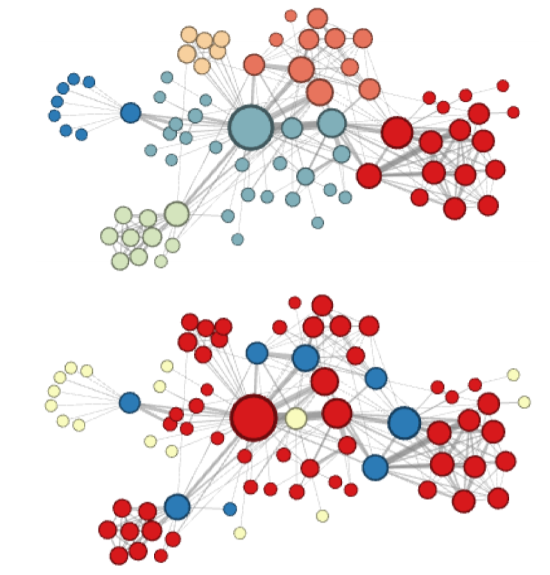
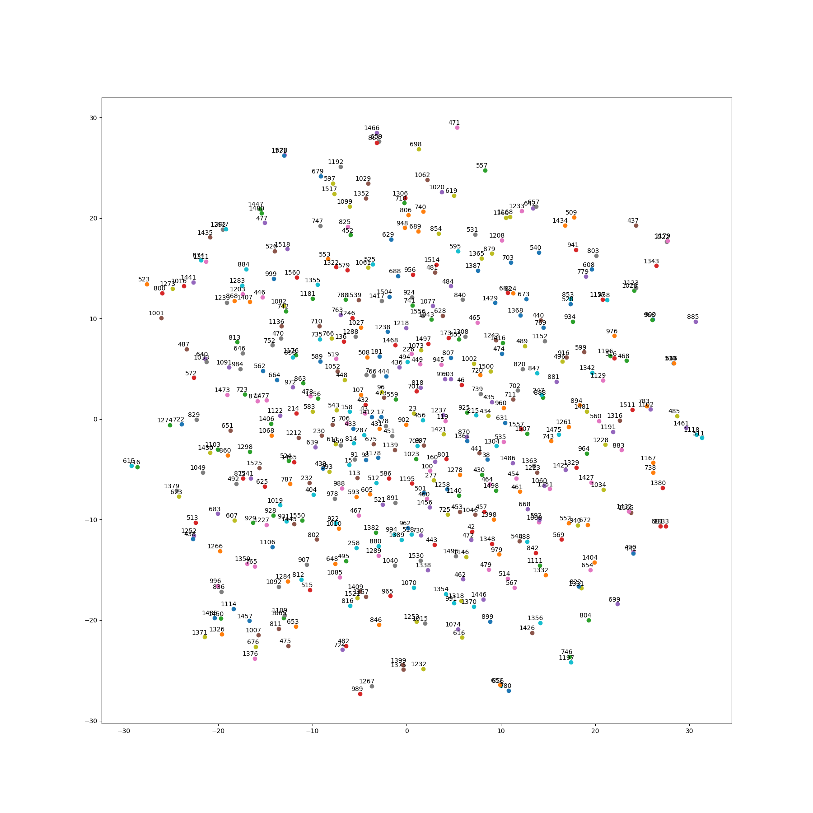

# Node2VecGPU
This is an implementation of node2vec with tensorflow, based on the original one of aditya-grover and word2vec tutorial of tensorflow. It can deal with graphs with massive number of nodes or densely connected graphs faster.

`"Node2Vec is an algorithmic framework for learning continuous feature representations for nodes in networks. In
node2vec, we learn a mapping of nodes to a low-dimensional space
of features that maximizes the likelihood of preserving network
neighborhoods of nodes. We define a flexible notion of a node’s
network neighborhood and design a biased random walk procedure,
which efficiently explores diverse neighborhoods."`

_source: node2vec: Scalable Feature Learning for Networks_

-- Aditya Grover, Jure Leskovec

_Complementary visualizations of Les Misérables coappearance network generated by node2vec with label colors reflecting homophily (top) and structural equivalence (bottom)._

_sample plot with tsne_

### Basic Usage
The usage is exactly the same as the original one, except for a few changes of hyper parameters for tensorflow.
##### Example
To run node2vec, execute the following command from the project home directory:
`python src/main.py --input ../graph/listed_weight.edgelist --output ../emb/karate.emb`

##### Options
You can check out the other options available to use with node2vec using:
`python src/main.py --help`

##### Input
The supported input format is an edgelist:

`node1_id_int node2_id_int <weight_float, optional>`

##### Output
The output is different from the original implementation.

The output file has n lines for a graph with n vertices.

The n lines are as follows:

`node_id dim1 dim2 ... dimd`

##### New Parameters

`--start_learning_rate`: The initial learning rate used for training

`--end_learning_rate`: The end learning rate used for training

`--decay_power`: how the learning rate decay when the number of iterations increasing (0.01 ~ 10)

`--iter`: how many iterations used in training (>1)

`--batch_size`: The batch size of training Word2Vec (>1)

`--num_sampled`: the number of negative samples used in negative sampling (>1) 